# <p align="center">Algoritmo Software Render e Wireframe</p>
## <p align="center">Projeto secundário usando Scratch</p>
#### <p align="center">Trabalho de Computação Gráfica, faculdade de Ciência da Computação, UNIOESTE (Universidade Estadual do Oeste do Paraná)</p>
##### <p align="center">Desenvolvido por: [Gabriel Mazzuco](https://github.com/gabrielmazz) e [Rodrigo Rocha](https://github.com/Rodrigo2603)</p>

# <p align="center">Introdução</p>

Este trabalho foi uma primeira versão do [Software Render](https://github.com/gabrielmazz/software-render) sendo implementado usando o Python e a biblioteca pygame. Primeiramente foi realizado a coleta dos pontos num ambiente 2D chamado de Wireframe, posteriormente foi realizado a revolução do objeto em torno de um eixo, gerando um objeto em 3D

<p align="center">
    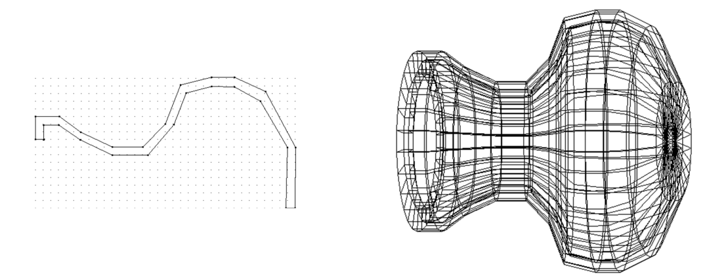
</p>

<p align="center">
    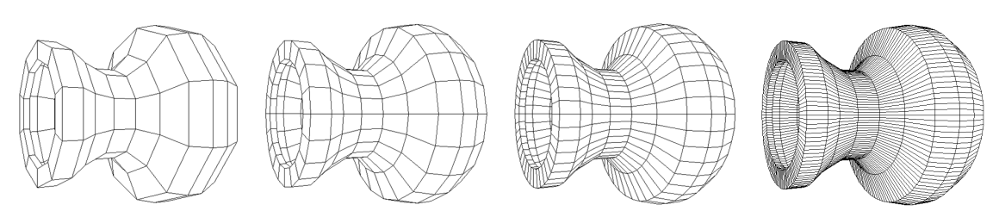
</p>

# <p align="center">Implementação</p>

Primeiramente o programa possui uma interface aonde é possivel escolher rederizar um objeto usando a técnica da revolução, assim o usuário poderá utilizar o Wireframe, rederização direta aonde será mostrado um cubo como um objeto pré desenhando e por último, objetos importados aonde o usuário pode colocar algum objeto .obj baixado pela internet

<p align="center">
    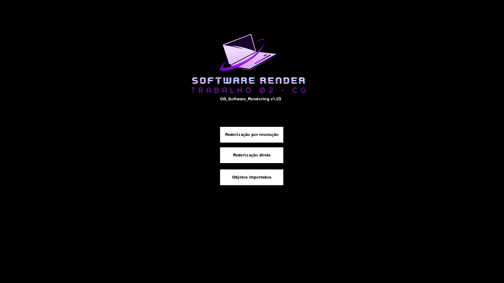
</p>

### <p align="center">Rederização por revolução</p>

O objeto 3D está apresentado na técnica wireframe, sem ocultação de superfícies. O número de fatias usadas na revolução foi igual a 30, ou seja, a cada 360º/30 = 12º criou-se um paralelo para delimitar as faces do objeto. É possivel colocar mais de um objeto em tela também, basta apenas desenhar os objetos no wireframe.

<p align="center">
    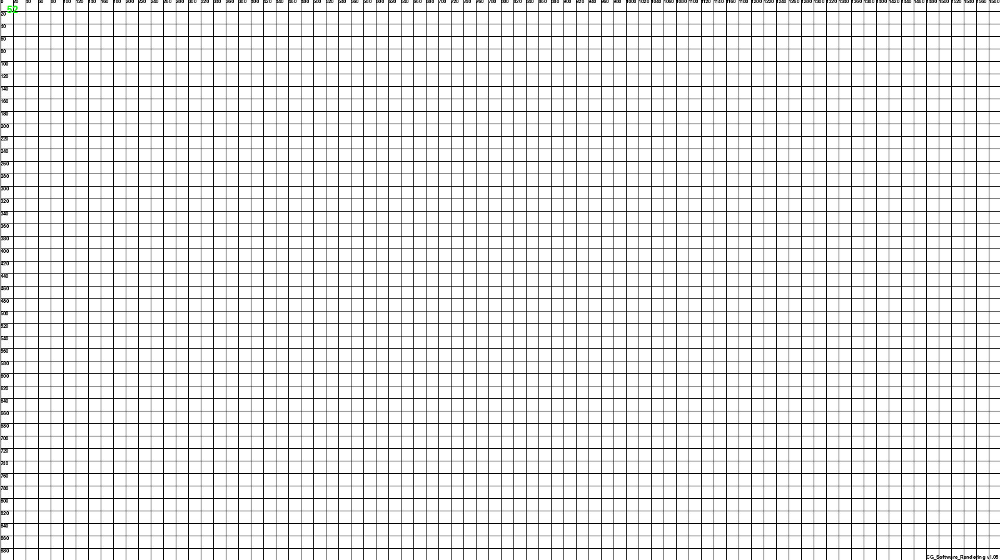
</p>

O usuário pode clicar com o botão direito do mouse para selecionar os pontos na tela, ele será previamente mostrado em seu formato 2D, com os comando DEL, o usuário podera finalizar a aplicação, C para limpar os pontos, 1 para abrir uma tela do TkInter aonde poderá escolher quantas fatias o usuário deseja para revolucionar o objeto e por fim 2 para inserir manualmente os pontos x e y (este comando será mostrado via terminal)

<p align="center">
    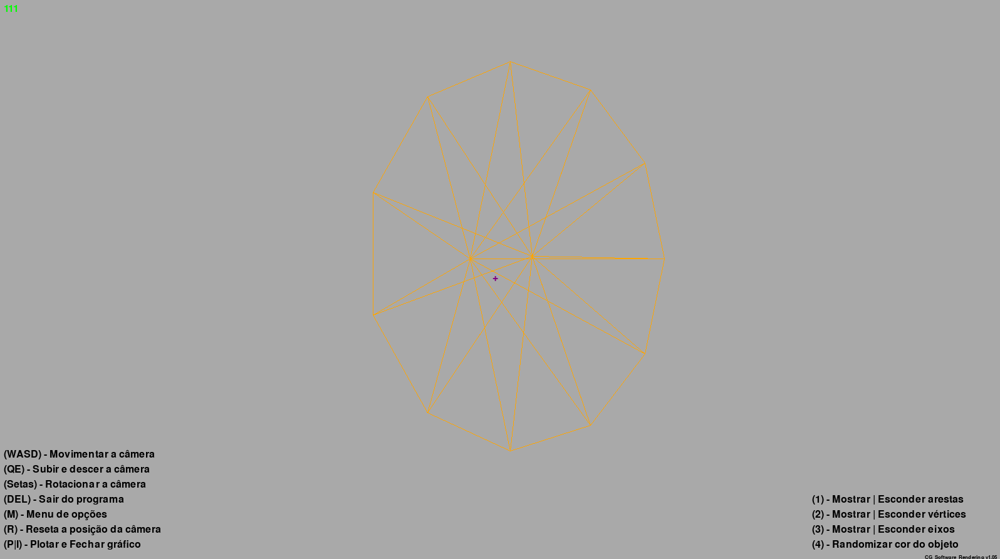
</p>

### <p align="center">Rederização direta</p>

Como dito acima, a rederização direta é um cubo pré desenhado, com as seguintes especificações dentro do software. Todo o programa foi baseado nesta rederização, seja seus vertices e faces.

```python
self.vertexes = np.array([(0, 0, 0, 1), (0, 1, 0, 1), (1, 1, 0, 1), (1, 0, 0, 1),
                                  (0, 0, 1, 1), (0, 1, 1, 1), (1, 1, 1, 1), (1, 0, 1, 1)])
        
self.faces = np.array([(0, 1, 2, 3), (4, 5, 6, 7), (0, 4, 5, 1), (2, 3, 7, 6), 
                        (1, 2, 6, 5), (0, 3, 7, 4)])
```

<p align="center">
    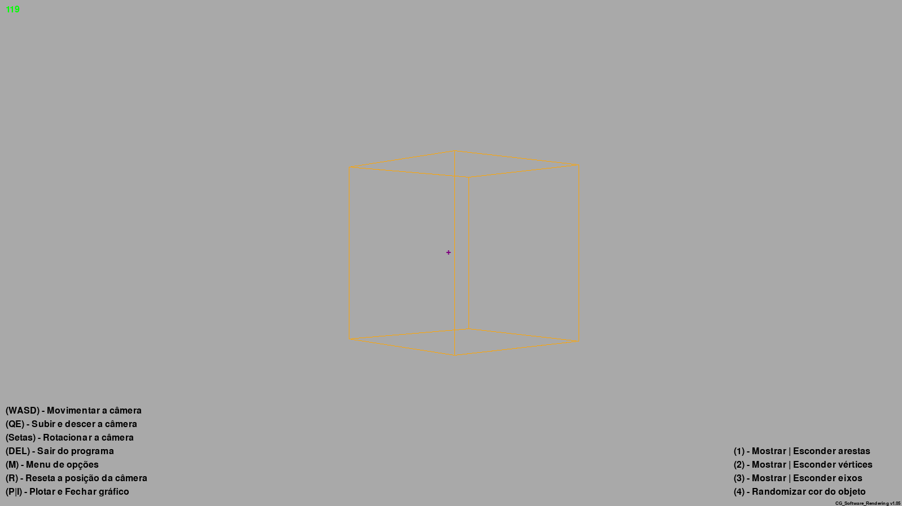
</p>

### <p align="center">Objetos importado</p>

Por último mas não menos importante, a rederização de objetos já modelados e importados pelo usuário. O programa aceita arquivos .obj, aonde o usuário poderá escolher o objeto que deseja rederizar. O programa aceita apenas um objeto por vez, mas é possivel importar mais de um objeto, basta coloca-lo na pasta *resources* (./Renderings/resources).

<p align="center">
    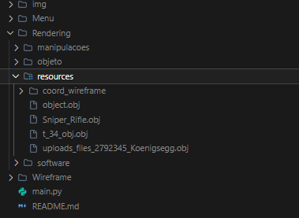
</p>

<p align="center">
    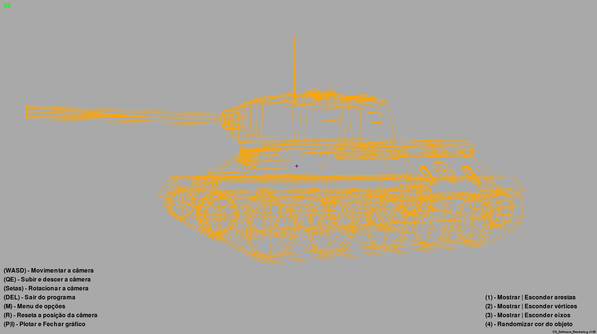
</p>

## <p align="center">Detalhes da implementação</p>

### <p align="center">Instalando as dependências do projeto</p>

Primeiro antes de tudo, é preciso instalar as dependências do projeto, para isso, basta rodar o seguinte comando:

```bash
./install.bash
```

ou apenas instala manualmente:

```bash

# Instalação do python3-pip
sudo apt-get update
sudo apt-get install python3-pip -y

# Instalação do pygame
pip install pygame

# Instalação do matplotlib
pip install matplotlib

# Instalação do numba
pip install numba

# Instalação do plotly
pip install plotly

```

## <p align="center">Como executar</p>

Para executar o projeto, basta rodar o seguinte comando, para tanto, é necessário ter todo o ambiente configurado e as dependências instaladas

```bash
python3 main.py
```


### <p align="center">Como foram utilizadas as dependências</p>

O matplotlib foi utilizado para abrirmos em tela, gráficos aonde mostra como o objeto está portado num ambiente 2D e também no 3D. Sendo utilizado para uma observação em um ambiente mais convencional.

<p align="center">
    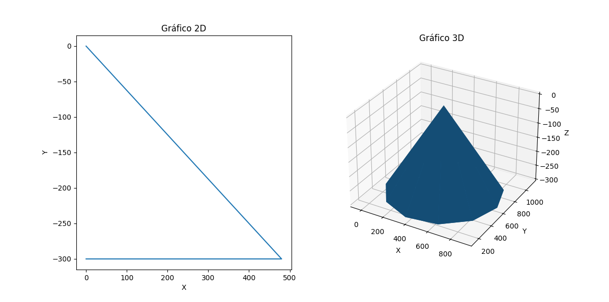
</p>

Já o numba, foi utilizado para otimizar o código, aonde temos funções que executam muitas operações ao mesmo tempo, principalmente utilizada na rederização dos objetos na tela, se tornando bem inviavel sem a sua utilização, já que o projeto fica muito mais pesado do que já é, tirando muito a limitação do próprio python

<p align="center">
    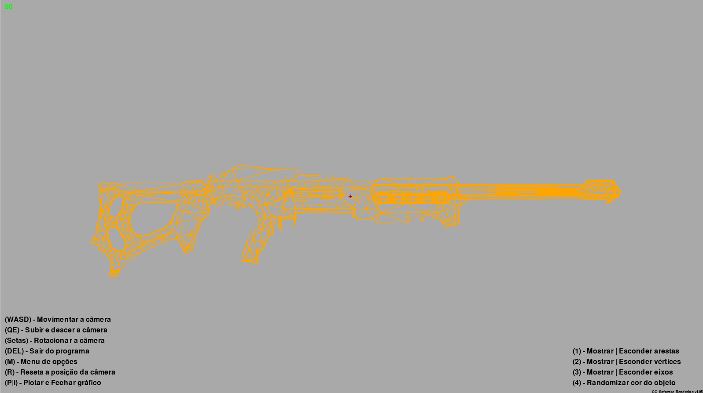
</p>


### <p align="center">Botões para a utilização</p>

- ```WASD``` - Movimentação da camera
- ```Q``` - Subir a camera
- ```E``` - Descer a camera
- ```Setas``` - Rotacionar a camera
- ```M``` - Menu de opções (console)
    - ```1``` - Modificação de cores
        - ```1``` - Modificação da cor do fundo
        - ```2``` - Modificação da cor do objeto
        - <p align="">
                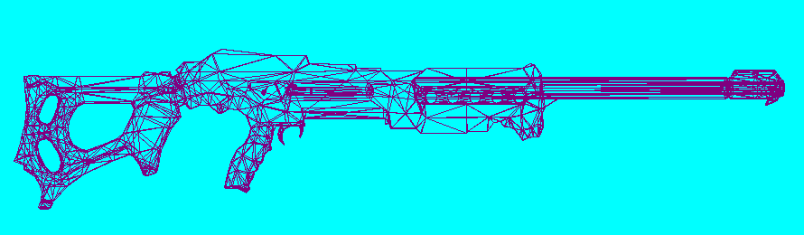
            </p>

    - ```2``` - Modificação na composição do objeto
        - ```1``` - Vertices
            - ```1``` - Mostrar vertices
            - ```2``` - Esconder vertices
            - <p align="">
                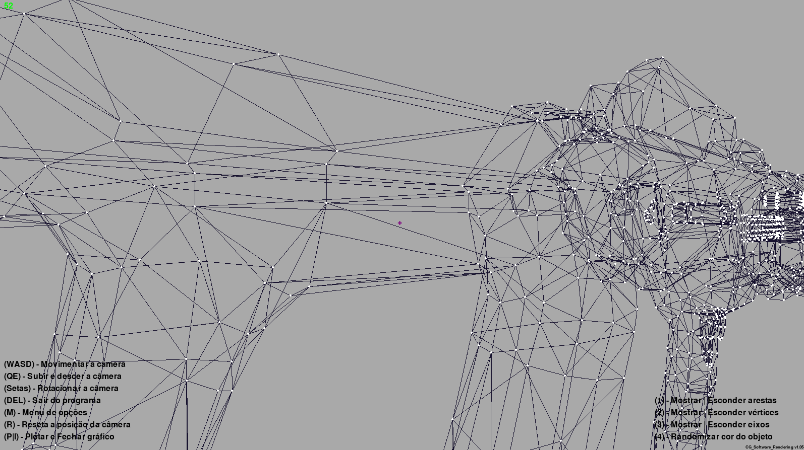
            </p>

        - ```2``` - Faces
            - ```1``` - Apenas arestas
            - ```2``` - Apenas faces
            - <p align="">
                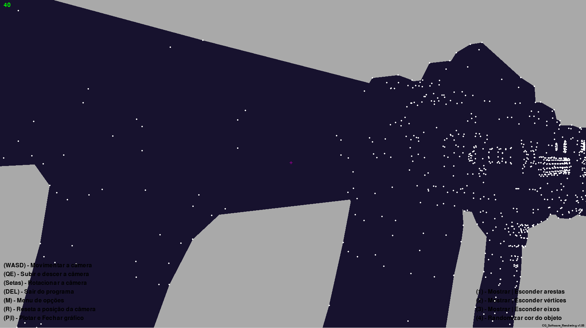
            </p>

    - ```3``` - Mostrar | Esconder os eixos XYZ
        - <p align="">
                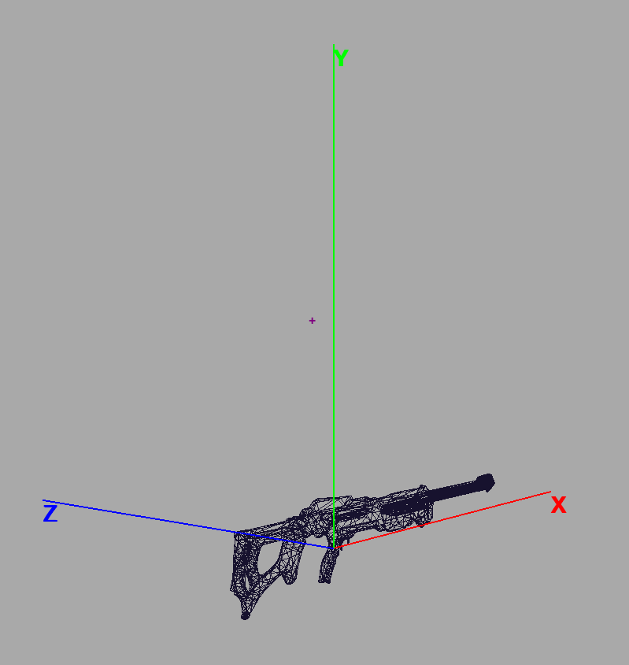
            </p>

- ```R``` - Resetar a camera	
- ```P | I ``` - Plotar e fechar o gráfico do matplotlib


#### <p align="center">Atalhos</p>

- ```DEL``` - Finalizar a aplicação	
- ```1``` - Mostrar | Esconder arestas
- ```2``` - Mostrar | Esconder vertices
- ```3``` - Mostrar | Esconder eixos
- ```4``` - Randomiza cor do objeto

#### <p align="center">Atalhos (desenvolvimento)</p>

- ```I``` - Translação para cima
- ```K``` - Translação para baixo
- ```J``` - Translação para esquerda
- ```L``` - Translação para direita

## <p align="center">Requisitos mínimos de hardware</p>

O software foi desenvolvido para rodar em qualquer computador, mas conforme os objetos se tornam mais complexos, seja na revolução ou mesmo algum baixado, o software pode ficar mais pesado e sabendo que o python não é uma linguagem muito performática, é necessário ter um hardware um pouco mais robusto e mesmo assim fica sujeito a travamentos

- Processador: Intel Core i3 ou superior
- Memória RAM: 4GB ou superior
- Espaço em disco: 1GB ou superior
- Sistema operacional: Windows 10 | 11 ou Linux

### <p align="center">Hardware em que o projeto foi desenvolvido</p>

- Processador: Intel Core i7-11800H @ 2.30GHz (16 CPUs), ~2.3GHz
- Memória RAM: 16GB DDR4 3200MHz
- Placa de vídeo: NVIDIA GeForce RTX 3050 Laptop GPU - 4GB GDDR6
- Sistema operacional: Windows 11 com WSL2 (Ubuntu 24.04)

## <p align="center">Referências</p>

- Adair, S. C. Transformações Geométricas. Recuperado em 04 de abril de 2024, de https://www.inf.unioeste.br/~adair/CG/Notas%20Aula/Slides%2004%20-%20Transformacoes%20Geometricas.pdf

- Adair, S. C. Visualização em 3D. Recuperado em 04 de abril de 2024, de https://www.inf.unioeste.br/~adair/CG/Notas%20Aula/Slides%2005%20-%20Visualizacao%20em%203D.pdf

- Adair, S. C. Iluminação e Sombreamento. Recuperado em 04 de abril de 2024, de https://www.inf.unioeste.br/~adair/CG/Notas%20Aula/Slides%2008%20-%20Iluminacao%20e%20Sombreamento.pdf

- Microsoft Corporation. (2023). Microsoft Copilot. https://copilot.github.com

- ChatGPT. (2023). Resposta de assistente de IA. OpenAI. https://chat.openai.com